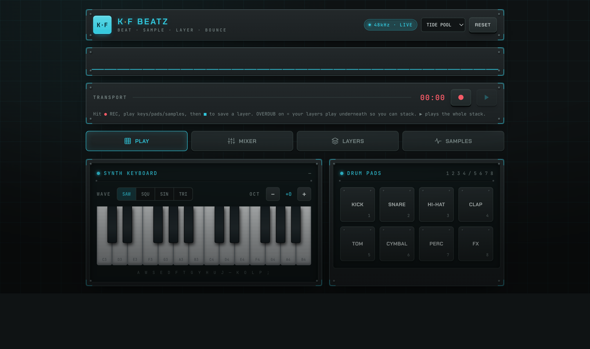

# K·F BEATZ

> A self-contained, offline-capable beat-making studio that lives in a **single HTML file**.

**▶ [Try it live](https://gitspoked.github.io/kfbeatz/)** — no install, runs in your browser.

K·F BEATZ is a **beat engine**: a browser-based groove box for sketching beats — synth voices, drums, sample chopping, layered patterns, MIDI import, and WAV bounce — with **no external program needed, just a browser**. Open the file and play.



## ✨ Features

- **Step sequencer** — program drums and synth voices across a grid of steps.
- **Built-in synth & drums** — generate sounds entirely in the browser via the Web Audio API; no samples required to get started.
- **Sample import** — drop a `.wav` or `.mp3` onto the page to add it as a playable sample.
- **MIDI import** — drop a `.mid` file to add it as a new layer.
- **Layers** — stack multiple patterns/instruments into a single arrangement.
- **WAV bounce** — render your arrangement to a `.wav` file you can download.
- **Filters & effects** — shape each voice with filtering and delay.
- **Tempo control** — set the BPM for your groove.
- **YouTube play-along** — drop in a video to jam over (audio-only reference; not part of the bounce).
- **Themes** — `cyan`, `amber`, and `magenta` looks.
- **Works offline** — everything runs locally. Google Fonts load when online and fall back to system fonts when not.

## 🚀 Getting started

No install, no dependencies, no build.

### Option A — open locally
```bash
# clone, then just open the file in any modern browser
open KF_BEATZ.html        # macOS
# xdg-open KF_BEATZ.html  # Linux
# start KF_BEATZ.html     # Windows
```

### Option B — live demo (GitHub Pages)
The app is hosted and ready to play, no clone required:

> **<https://gitspoked.github.io/kfbeatz/>**

## 🎛️ Usage

1. Set your tempo (BPM).
2. Toggle steps on the sequencer to program a pattern.
3. Drop a `.wav`/`.mp3` to add a sample, or a `.mid` to add a layer.
4. Tweak filters/effects per voice.
5. Hit **bounce** to render your arrangement to a downloadable `.wav`.

### ⌨️ Keyboard shortcuts

| Keys | Action |
|------|--------|
| `Space` | Play / stop the transport |
| `A W S E D F T G Y H U J K O L P ;` | Play synth notes (piano layout, C3 → E4) |
| `1` `2` `3` `4` | Drum pads — kick, snare, hi-hat, clap |
| `5` `6` `7` `8` | Drum pads — tom, cymbal, perc, fx |

> Shortcuts are ignored while typing in an input field, so they won't interfere with text entry.

## 🧱 Project structure

```
kfbeatz/
├── KF_BEATZ.html     # the entire application (HTML + CSS + JS, self-contained)
├── index.html        # redirect + social meta tags (for GitHub Pages root)
├── assets/
│   ├── screenshot.png  # README hero
│   └── og.png          # social link-preview card
├── README.md
├── LICENSE-MIT
└── LICENSE-APACHE
```

## 🌐 Browser support

Requires a modern browser with **Web Audio API** support (Chrome, Edge, Firefox, Safari). Audio export uses in-browser rendering — no server involved.

## 📄 License

Licensed under either of

- Apache License, Version 2.0 ([LICENSE-APACHE](LICENSE-APACHE) or <http://www.apache.org/licenses/LICENSE-2.0>)
- MIT license ([LICENSE-MIT](LICENSE-MIT) or <http://opensource.org/licenses/MIT>)

at your option.

Unless you explicitly state otherwise, any contribution intentionally submitted for inclusion in this project by you, as defined in the Apache-2.0 license, shall be dual licensed as above, without any additional terms or conditions.
